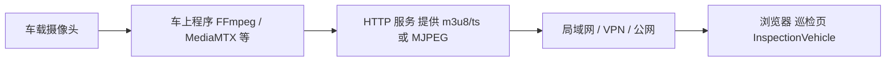

# 硬件端与软件系统通讯、对接说明

本文说明**车载/井场硬件**为对接本项目的「环境监测 Web + 巡检与遥控页」需要完成的工作，并列出涉及的**通讯协议**。实现细节可与 `硬件端设计文档.md` 中的模块划分对照。

---

## 1. 总体：三类数据流

| 类别 | 方向 | 作用 | 硬件侧典型职责 |
|------|------|------|----------------|
| **环境传感** | 硬件 → 云平台 → 本后端 | 温湿度、光照等 | 按约定主题 **MQTT 发布** JSON |
| **车辆运动** | Web → 本后端 →（待扩展）→ 硬件 | 前进/转向/停止等 | 接收指令并驱动电机；当前后端为 **MVP 内存模拟**，真车需增加**网关转发** |
| **视频监控** | 硬件/网关 → HTTP → 浏览器 | 实时画面 | 采集图像并输出 **HLS** 或 **MJPEG** 等浏览器可访问的 HTTP 流 |

三类彼此独立：**视频不必走 MQTT**；**控制指令也不必与视频同端口**。

---

## 2. 通讯协议一览

以下为**实际会出现在链路上**的协议（按 OSI 以上应用习惯称呼）：

| 协议 | 用在何处 | 说明 |
|------|----------|------|
| **MQTT 3.1.1** | 传感器上行 | 设备连接百度智能云 IoT Core Broker（TCP，常见端口 **1883** 或 **8883** TLS），向订阅主题发布 **UTF-8 JSON** 载荷。 |
| **HTTP/1.1** | 视频拉流 | 浏览器或反代访问 **HLS**（`application/vnd.apple.mpegurl` + `video/mp2t` 切片）或 **MJPEG**（`multipart/x-mixed-replace` 等）。 |
| **HLS**（基于 HTTP） | 视频 | 播放列表 `.m3u8` + 分片 `.ts`；适合 Web 与弱网，延迟通常数秒级。 |
| **MJPEG**（基于 HTTP） | 视频（可选） | 连续 JPEG 帧，实现简单，带宽较大；可用 `` 或专用播放器。 |
| **RTSP** | 摄像头到转码（常见） | 多在**局域网**内从 IPC/采集卡到 **FFmpeg / MediaMTX**，**不直接进浏览器**；需转 HLS/WebRTC 等。 |
| **WebSocket** | 浏览器 ↔ 本后端 | 用于前端实时展示 `sensor_data`、`vehicle_status` 等；**不要求车载硬件实现 WebSocket**。 |
| **HTTPS + JSON（REST）** | 浏览器 ↔ 本后端 | 如 `POST /api/vehicle/control`；**当前不直达车端**，真车需网关在中间转换。 |

**本后端当前不提供的协议**：车载硬件**不要假设**后端会主动用 TCP 长连接直连电机控制器；需自行设计「网关（如树莓派）」承接 MQTT/HTTP/串口。

---

## 3. 环境传感器：硬件要做的工作（MQTT）

### 3.1 协议与连接

- **协议**：MQTT **3.1.1**（代码侧使用 `MQTTv311`）。
- **Broker**：百度智能云 IoT Core，主机名形如  
  `{IOT_CORE_ID}.iot.{REGION}.baidubce.com`（见后端 `.env` 中 `MQTT_IOT_CORE_ID`、`MQTT_REGION`）。
- **认证**：与控制台物模型/设备一致的用户名、密码（MD5 签名规则由平台定义）；硬件端使用**设备侧**凭证，后端建议使用**独立网关凭证**订阅，避免与调试工具「互踢」—详见后端 `app/core/mqtt.py` 注释。

### 3.2 主题与载荷

- **默认发布主题**：与后端订阅一致，例如 **`sensor/data`**（可在后端 `MQTT_SUBSCRIBE_TOPICS` 中配置多个主题，逗号分隔）。
- **载荷格式**：**JSON 对象**，UTF-8。后端会识别下列字段（别名亦可）：

| 语义 | 推荐字段名 | 可接受别名示例 |
|------|------------|----------------|
| 设备标识 | `deviceId` / `device_id` | `deviceName` |
| 温度 ℃ | `temperature` | `temp`, `t` |
| 湿度 %RH | `humidity` | `hum`, `rh` |
| 光照 lx | `light` | `lux`, `illumination` |
| 时间 | `timestamp` | `ts`, `time`（支持毫秒/秒数字或 ISO8601） |

**至少包含一个**与温/湿/光相关的字段，否则消息会被忽略。

### 3.3 示例载荷

```json
{
  "deviceId": "well_site_01",
  "temperature": 26.4,
  "humidity": 52.1,
  "light": 380,
  "timestamp": 1710000000000
}
```

### 3.4 硬件侧任务清单

- [ ] 在 IoT 平台创建设备，配置与现场一致的 **DeviceKey / Secret**。
- [ ] 固件实现 MQTT 连接、重连、QoS 策略（建议至少对关键上报使用 QoS 1，按平台限制调整）。
- [ ] 按上表组 JSON，向约定 **Topic** **PUBLISH**。
- [ ] 与运维确认 `MQTT_SUBSCRIBE_TOPICS` 与物模型规则引擎（若有）一致。

---

## 4. 车辆控制：硬件要做的工作（与当前软件边界）

### 4.1 当前软件行为（MVP）

- Web 通过 **HTTPS/HTTP** 调用 **`POST /api/vehicle/control`**，Body 为 JSON：`action`（`forward` / `backward` / `left` / `right` / `stop`）、`speed`（0–100）、`timestamp`（毫秒）。
- 后端更新**内存状态**，并通过 **WebSocket** 向浏览器推送 `vehicle_status`。

**即：当前仓库不把车控指令转发到真实 CAN/串口/MQTT 设备。** 硬件若要「真动」，需要额外**网关服务**。

### 4.2 建议的硬件架构（供落地时选用）

任选或组合：

1. **MQTT 下行（推荐与现有 IoT 统一）**  
   - 网关节点（车载树莓派等）订阅例如 `vehicle/{deviceId}/command`，收到 JSON 后解析 `action`/`speed`，调用现有电机驱动代码。  
   - 需在平台或自建 Broker 上配置**规则引擎 / 后端扩展**，把 `POST /api/vehicle/control` 转为对该主题的 **PUBLISH**（本仓库未内置，属集成开发项）。

2. **局域网 HTTP**  
   - 车上跑轻量 HTTP 服务（如 Flask/FastAPI），接收 `POST /control`；办公室后端或边缘网关把 Web 指令转发到车机 IP（注意防火墙与 TLS）。

3. **串口 / ROS2 / 自定义**  
   - 仅在车端闭环，由网关把 MQTT/HTTP 转成串口帧。

### 4.3 状态回传（与前端展示一致）

若希望 Web 上「连接状态 / 左右轮速度」与真车一致，网关应：

- 周期性上报状态到后端可消费通道（例如扩展 **MQTT 主题** `vehicle/status`，由后端订阅并写入 `VehicleRepository` + WebSocket），或  
- 由其对接现有 **WebSocket** 的扩展接口（需改后端代码）。

### 4.4 硬件侧任务清单（真车）

- [ ] 实现电机驱动与安全策略（超时停车、急停等）。
- [ ] 部署**网关**：至少能接收一种来自「可被后端触达的网络」的指令格式。
- [ ] 与软件团队约定 **Topic 或 HTTP 路径** 及 JSON 字段，并完成后端/规则引擎的转发开发。
- [ ] （可选）实现状态上行，与 `VehicleStatusResponse` 字段对齐：`mode`、`speed`、`left_speed`、`right_speed`、`connected` 等。

---

## 5. 视频：从智能车上传到 Web 页面如何显示

本节回答：**智能车上的画面，怎样出现在浏览器里**。结论先说清楚：

- **视频数据不经过本项目的业务后端**（不经过 `POST` 传图、也不走 MQTT 传整段视频）；后端只通过 **`GET /api/video/stream-config`** 告诉前端「去哪个 **HTTP(S) 地址** 拉流」。
- **真正上传/对外提供画面的是「车上或同网段的视频服务」**：把摄像头变成 **可通过浏览器访问的 HTTP 流**（**HLS** 或 **MJPEG**）。浏览器用 **hls.js** 或 `` **直接拉这条 HTTP 流**。

### 5.1 整体路径（从车到屏幕）



| 步骤 | 在哪里做 | 做什么 |
|------|----------|--------|
| ① 采集 | **智能车**（树莓派、工控机等） | USB/CSI 摄像头或 RTSP IPC 取原始画面。 |
| ② 编码与封装 | **仍在车上或跟随车的网关** | 用 **FFmpeg** 或 **MediaMTX** 等：把原始流转成 **HLS**（目录里不断生成 `.m3u8` + `.ts` 小文件）或 **MJPEG**（一条 HTTP 响应里连续发 JPEG）。 |
| ③ 对外提供 URL | **同上（HTTP 服务器）** | 例如 `http://车机IP:8888/live/cam/index.m3u8` 或 `http://车机IP:8080/mjpeg`。这是「上传」的本质：**对网络暴露一个可反复 GET 的视频地址**。 |
| ④ 浏览器能访问 | **网络 + 可选 Nginx/Vite** | 若 Web 站点与车机不同源，需 **同一内网可达**，或用 **Nginx 反向代理** 把 `https://你的域名/live/...` 转到车机；开发时可用 Vite 把 `/live` 代理到 MediaMTX。 |
| ⑤ 页面播放 | **Web 前端** | 打开巡检页 → 请求 **`/api/video/stream-config`** 拿到配置的 URL → **hls.js** 播 HLS，或 **``** 播 MJPEG。 |

**一句话**：智能车负责「**把摄像头变成浏览器能拉的 HTTP 视频地址**」；Web 只负责「**知道这个地址并播放**」。

### 5.2 为什么不走 MQTT / 业务 WebSocket 传视频？

- MQTT、现有 **WebSocket** 更适合**小消息**（传感器数值、状态）。连续视频码率大，用它们传要么严重占带宽，要么要在后端再做一层转码/分发，复杂且贵。
- 因此行业常规是：**视频单独走 HTTP 流媒体**（HLS/WebRTC 等），与传感器 MQTT **分流**。

（若将来要做「经服务端转发」，一般是专门媒体服务器或 WebRTC SFU，仍不是走 `sensor/data` 这类主题。）

### 5.2a 需求：实时监测 + 根据画面远程控车

若操作员**盯着 Web 画面**打方向、调速，画面与现场之间的时间差会直接进入「人—机闭环」。此时：

| 方案 | 典型端到端延迟（量级） | 是否适合「盯屏远控」 |
|------|------------------------|----------------------|
| **HLS（默认长切片）** | 约 10～30 秒 | **不适合**精细实时；仅适合「看一眼环境」。 |
| **HLS（短切片 + 调参）** | 约 5～10 秒 | **勉强**慢速挪车；急弯、避障仍容易滞后。 |
| **MJPEG（中等帧率）** | 约 0.5～2 秒 + 网络 | 局域网内**常优于默认 HLS**；带宽大、画质一般。 |
| **WebRTC** | 常 **1 秒以内**（视网络） | **适合**浏览器里实时监测 + 远控的**主画面**。 |
| **非浏览器**（VLC、专用客户端拉 **RTSP**） | 可较低 | 适合值班机；与现有 Vue 页分离。 |

**建议架构（与当前仓库的关系）**：

1. **控制指令**：仍可走现有 **`POST /api/vehicle/control`**（及后续扩展 MQTT 到真车）；控制链路与视频**解耦**。  
2. **视频**：若业务明确为「实时远控」，应规划 **WebRTC**（车上或边缘跑 **mediasoup / LiveKit / Pion + WHIP/WHEP**，或 **MediaMTX 的 WebRTC**），前端用 **`RTCPeerConnection`** 或封装库收流，而不是长期依赖 **默认 HLS**。  
3. **安全**：远控需鉴权、限速、急停、超时停车；**不要**仅靠「看得见」一条链。  
4. **折中落地**：短期可用 **短切片 HLS 或 MJPEG** 验证流程；**并行**立项 WebRTC，避免量产后才发现延迟不可接受。

当前代码中的 **HLS/MJPEG 配置 + hls.js** 更适合「**监视、巡检回看**」；**强实时远控**请在设计评审中单列 **低延迟视频** 方案，与本文 **5.2a** 对齐。

### 5.3 协议说明（浏览器实际用到的）

- **浏览器侧**通过 **HTTP(S)** 获取：
  - **HLS**：主播放列表 URL 以 `.m3u8` 结尾，切片为 `.ts`；或  
  - **MJPEG**：适合快速验证的连续 JPEG 流 URL。
- **摄像头到转码** 常见为 **RTSP** 或本地设备节点；**RTSP 不直接给浏览器**，必须在车端先转成 HLS/MJPEG 再通过 **HTTP** 提供。
- **与本后端的关系**：`VIDEO_HLS_PLAYLIST_URL` / `VIDEO_MJPEG_URL` 只写入「播放地址」；**流本身由车/网关/Nginx 提供**，须保证用户浏览器**能访问该 URL**（同源反代或 CORS/HTTPS 合规）。

### 5.4 硬件侧任务清单（视频）

- [ ] 摄像头驱动与采集（USB / CSI / RTSP 源）。
- [ ] 运行转码/封装：**RTSP → HLS**（推荐生产）或 **MJPEG**（简易）。
- [ ] 配置 HTTP 服务端口、路径；生产环境建议 **HTTPS** 与站点同域或通过 Nginx 反代（避免混合内容拦截）。
- [ ] 将最终给浏览器用的 **m3u8 或 MJPEG URL**（或同源相对路径）交给运维写入后端 `VIDEO_*` 环境变量。

### 5.5 端口与路径配置（视频「上传」= 对外提供 HTTP 流）

视频不经过 FastAPI 端口；需要配置的是：**转码服务监听端口**、**浏览器访问的路径/域名**，以及开发时 **Vite 代理**。

#### 5.5.1 角色与端口（典型值，可按实际改）

| 服务 | 默认/常见端口 | 说明 |
|------|----------------|------|
| **Vue 开发服务器（Vite）** | **5173** | 浏览器打开 `http://localhost:5173`；`/api`、`/ws`、`/live` 在此被代理。 |
| **本仓库 FastAPI（Uvicorn）** | **8000** | 只提供 `GET /api/video/stream-config` 等；**不转发视频字节**。 |
| **MediaMTX / FFmpeg HLS HTTP** | **8888**（MediaMTX 默认 HLS 常在此） | 车上或本机转码后，m3u8/ts 由此端口提供；**以你实际 `mediamtx.yml` / 命令为准**。 |
| **自写 MJPEG 小服务** | **8080** 等任意 | 在 `VIDEO_MJPEG_URL` 里写全量 URL，如 `http://192.168.1.10:8080/video`。 |
| **生产 Nginx** | **443**（HTTPS） | 对外统一域名；`location /live/` 反代到内网转码机 `http://内网IP:8888/`。 |

防火墙需放行：**浏览器 → 转码端口**（开发时经 Vite 则只访问 5173）；生产则放行 **443** 到 Nginx。

#### 5.5.2 开发环境（推荐：同源 + 代理，避免 CORS）

1. **转码服务**（如 MediaMTX）在本机或局域网某机监听，例如 **`http://127.0.0.1:8888`**，并产出路径形如 **`/cam/stream/index.m3u8`**（以实际为准）。  
2. **`web-frontend/.env.development`**（或环境变量）设置：  
   - `VITE_DEV_PROXY_TARGET=http://127.0.0.1:8000`（后端 API）  
   - **`VITE_VIDEO_HLS_PROXY_TARGET=http://127.0.0.1:8888`**（HLS 根；与 `vite.config.js` 中 `/live` 的 `target` 一致）  
3. **`backend/.env`**：  
   - **`VIDEO_HLS_PLAYLIST_URL=/live/cam/stream/index.m3u8`**（示例，**`/live` 后接转码服务上的真实路径**）  
   含义：浏览器请求 `http://localhost:5173/live/cam/stream/index.m3u8`；Vite 代理 **`rewrite` 会去掉 `/live` 前缀**，转发到 **`http://127.0.0.1:8888/cam/stream/index.m3u8`**（与 `vite.config.js` 一致）。  

4. **MJPEG 开发**：若用 `http://车机IP:8080/...`，与 5173 不同源，可能 CORS；可再给 Vite 加一段 **`/mjpeg` 代理** 或临时关跨域（不推荐生产）。

#### 5.5.3 生产环境

- 浏览器只访问 **`https://你的域名`**。  
- **Nginx** 示例思路：  

```nginx
location /live/ {
    proxy_pass http://内网转码机IP:8888/;  # 注意末尾 / 与路径拼接
    proxy_http_version 1.1;
    add_header Access-Control-Allow-Origin *;  # 若前后端不同域且未同源，按需收紧
}
```

- **`VIDEO_HLS_PLAYLIST_URL`** 填 **`/live/.../index.m3u8`**（与 Nginx `location` 一致）。  
- **HTTPS 页面禁止 `http://` 的 MJPEG/HLS**，会混合内容拦截；转码或反代也须 **HTTPS** 或同域。

#### 5.5.4 相关文件

| 配置项 | 文件 |
|--------|------|
| HLS 播放列表路径（给前端的字符串） | `backend/.env` → `VIDEO_HLS_PLAYLIST_URL` |
| MJPEG 全 URL | `backend/.env` → `VIDEO_MJPEG_URL` |
| 开发代理：API / WS | `web-frontend/vite.config.js`、`VITE_DEV_PROXY_TARGET` |
| 开发代理：HLS 目标机与端口 | `web-frontend/vite.config.js`、`VITE_VIDEO_HLS_PROXY_TARGET` |

### 5.6 「直接到 JS 吗？」与「Python 后端还能不能做渲染 / 算法叠加？」

**不是把视频文件「上传到某个 .js 里」**。实际是：

- 浏览器里运行的 **JavaScript**（如 hls.js）按 URL 发起 **HTTP 请求**，持续下载 **m3u8 / ts** 或 **MJPEG**，再在内存里**解码、画到 `<video>` 或 `<canvas>`**。
- 视频字节流来自 **车或媒体服务器**，**不经过** 当前 FastAPI 里的 Python 业务代码。

**若后续要在画面里做算法叠加、且希望用 Python（OpenCV、PyTorch 等）处理**，需要把链路改成「**视频先经过能跑 Python 的环节**」，常见做法如下（可并存）：

| 方案 | 思路 | Python 角色 | 浏览器仍播 HLS？ |
|------|------|-------------|------------------|
| **A. 服务端再编码（推荐叠加进画面）** | 车推 **RTSP/RTMP** 到机房或边缘机 → **FFmpeg 管道** 或 **OpenCV 读帧** 画框/叠字 → 再编码成 **HLS** 输出到 Nginx | 子进程调 FFmpeg，或用 **opencv + 推流**（如写管道到 `ffmpeg` 再出 HLS） | 是，前端仍配 **处理后** 的 m3u8 URL |
| **B. 算法与画面分离** | 视频仍直连原始 HLS；Python 只跑检测，把 ** bbox / 告警 JSON** 经 **WebSocket 或 REST** 发给前端，在 **Canvas/WebGL** 上叠图层 | 后端异步任务读 RTSP/抽帧推理，**不重新编码视频** | 是，叠加在浏览器画（省算力，需时间对齐） |
| **C. 专用媒体框架** | 如 **GStreamer / DeepStream** 管线里嵌推理，输出仍 HLS/WebRTC | 多为 C++/绑定，Python 可编排管线 | 视输出而定 |

**结论**：

- **当前架构**：省算力、实现快，**Python 后端不参与每一帧视频**，因此**不能**在同一套链路里直接对「已播出的像素」做 OpenCV 处理。
- **要 Python 深度参与**：在 **车 → 浏览器** 之间加一层「**拉流 → 处理 → 再发布**」的服务（可在独立进程/容器里，不必堵死 FastAPI 主线程）；前端只要把 `VIDEO_HLS_PLAYLIST_URL` 改成指向 **处理后的** 播放列表即可。

### 5.7 分阶段落地：先只上传视频 → 再补 YOLO 叠加 → 再补车载视觉巡线

与当前代码库对齐的**推荐顺序**，避免一开始就把链路做复杂。

#### 阶段一（现在）：只做「视频能在 Web 上看到」

目标：**不上算法**，车端把摄像头变成浏览器可拉的 **HTTP 流**。

| 谁 | 做什么 |
|----|--------|
| **车载/网关** | 摄像头 + FFmpeg 或 MediaMTX，输出 **HLS**（推荐）或 **MJPEG**；固定好 **m3u8 或 MJPEG 的 URL**。 |
| **运维 / 本仓库** | 在 `backend/.env` 配置 `VIDEO_HLS_PLAYLIST_URL` 或 `VIDEO_MJPEG_URL`；保证浏览器经内网/VPN/反代能访问该 URL。 |
| **前端** | 已实现：`InspectionVehicle.vue` 拉 `GET /api/video/stream-config` 后自动播放，**无需为「以后 YOLO」先改页面**。 |

此阶段**不需要**写 YOLO、不需要 Python 读视频帧；与后续扩展**兼容**：以后只是多一条处理后的 URL 或多一路 WebSocket 数据。

#### 阶段二（以后）：YOLO 检测框叠加

在阶段一稳定后再做，二选一或组合：

- **叠加画进画面（方案 A）**：另起服务或进程「拉 RTSP/HLS → OpenCV + YOLO 画框 → ffmpeg 再编码 → 新 HLS」；把 `VIDEO_HLS_PLAYLIST_URL` 改为 **处理后** 的 m3u8（或配置里增加 `processed` 与 `raw` 两路 URL，前端再扩展切换）。
- **只叠数据不重新编码（方案 B）**：视频 URL **不变**；Python 抽帧跑 YOLO，结果经 **WebSocket** 推前端，在 **Canvas** 上画框（需做时间同步，开发量在前端）。

**建议**：若团队先熟悉模型，用 **B** 试错快；若要录像归档带框，用 **A**。

#### 阶段三（以后）：小车视觉巡线

与「给 Web 看画面」**可以并行、逻辑不同**：

- **巡线控制**强调**低延迟**，通常在 **车上单片机/树莓派** 用 OpenCV 做线提取 + PID，**直接驱动电机**；不必等画面传到服务器再决策。
- **Web 视频**仍可以是阶段一的 **原始 HLS**（看现场画面），或阶段二带检测的流（便于调试）。
- 若巡线状态要在页面显示：可增加 **MQTT** 主题或 **WebSocket** 上报 `偏差 / 模式(auto/manual)`，与现有 `vehicle_status` 类消息对齐即可（属后端与固件扩展项）。

```text
阶段一   摄像头 ──► 车上 HLS/MJPEG ──► 浏览器（当前架构）
阶段二   可选：中间加「YOLO 服务」──► 新 HLS 或 WS+Canvas
阶段三   车上巡线闭环；Web 仅观测 + 可选状态上报
```

#### 你现在要完成的检查清单（仅阶段一）

- [ ] 车端能稳定输出 **HTTP 可访问** 的视频地址（同网电脑用 VLC / 浏览器能验证）。
- [ ] 填写 `VIDEO_HLS_PLAYLIST_URL` 或 `VIDEO_MJPEG_URL`，重启后端。
- [ ] 打开「巡检与遥控」页，确认画面正常；开发环境按需配置 Vite **`/live`** 代理。

完成以上即可**先交付「只上传/只拉流视频」**；YOLO 与巡线按上表在后续迭代接入，**不必推翻阶段一架构**。

---

## 6. 网络与安全建议

- **MQTT**：生产优先 **TLS（8883）**，密钥不入库版本控制。
- **视频**：公网必须 **HTTPS**；内网 HTTP 仅用于调试。
- **车控**：指令通道需鉴权、防重放（时间戳 + 签名或 TLS 客户端证书），避免未授权运动。

---

## 7. 快速对照：谁实现哪种协议

| 节点 | MQTT | HTTP(S) 视频 | WebSocket | REST 车控 |
|------|------|--------------|-----------|-----------|
| 传感器板/网关 | **发布** | — | — | — |
| 车载视频网关 | 可选 | **提供** HLS/MJPEG | — | 可选接收车控 |
| 本后端 | **订阅**（传感器） | 仅返回配置 URL | **服务端** | **接收** Web 车控 |
| 浏览器 | 不直接使用 | **拉流** | **连接** | **调用 API** |

---

## 8. 相关文件索引

| 内容 | 路径 |
|------|------|
| MQTT 解析与字段规范 | `backend/app/core/mqtt.py` |
| 传感器主题配置 | `backend/.env` → `MQTT_SUBSCRIBE_TOPICS` |
| 车控 API | `backend/app/api/v1/vehicles.py` |
| 视频配置 API | `backend/app/api/v1/video.py` → `GET /api/video/stream-config` |
| 前端巡检与播放 | `web-frontend/src/views/InspectionVehicle.vue` |
| 视频环境变量示例 | `backend/.env.example` → `VIDEO_*`；车端对照 `raspberry-pi/config/backend.video.env.example` |

### 8.1 树莓派仓库 `raspberry-pi` 与本说明的对应（视频 §5）

| 本文章节 | 本仓库 |
|----------|--------|
| 车端 MJPEG HTTP 流 | `src/video_stream/`；`python -m video_stream` 或 `config.yaml` → `video_stream.enabled: true` 与 `src/main.py` 同进程 |
| 浏览器可访问的 URL | 默认 `http://<车机IP>:8080/video_feed`（另兼容 `/mjpeg`；主路径见 `video_stream.path`） |
| 与后端 `stream-config` 同构的 JSON（联调/自检） | 车端 `GET http://<车机IP>:8080/api/video/stream-config`（字段含 `mjpeg_url` / `mjpegUrl`） |
| 本地验证「视频显示」 | 车端 `GET http://<车机IP>:8080/preview`（页面内拉 stream-config 并 `` 播 MJPEG） |
| 后端 `.env` | 将 `VIDEO_MJPEG_URL` 设为与 `mjpeg_url` 相同的完整 URL，保证巡检页浏览器能访问 |

---

*文档版本：与当前代码库 MVP 行为一致；车控到达真车的 MQTT/HTTP 转发为集成扩展项，实施时以双方接口契约为准。*
